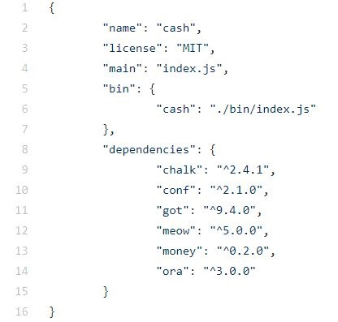

# cash

## Description :
Currency converter implemented in NodesJs

## Library used:
These libraries are inside the folder node_modules

	- conf
	- meaow
	- chalk
	- got
	- money
	- ora

## Installation

	1. We fork the repository : github.com/92bondstreet/3-musketeers

	2. We clone our forked repository project

		* cd /path/to/workspace
		* git clone git@github.com:YOUR_USERNAME/3-musketeers.git
	
	3. We install all the dependencies (node_modules)

		* cd /path/to/workspace/3-musketeers/cash
		* npm i
	
	4. chack that all dependencies are updates into the package.json file

## How to use in the terminal

For compute the currency converter we us the command cash like this:

	- node /bin/index.js cash <amount> <from> <to>
	- $ cash <options>

   Where the options are: --set -s   for set default currencies
	
Example: 
	-$ cash 35 usd eur pln

## Deeper focus on the code

Now, we can focus on the code which is inside the folder bin. There is 3 javascript files
	
	* cash.js
 	* constante.js
	* index.js

## cash.js

## index.js

# constant.js

	

 